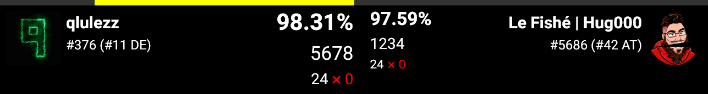

# BSPlus Tournament Score Overlay

*Tired of TournamentAssistant constantly having issues with displaying the scores on stream? Switch to the Multiplayer+ Tournament mode and use this customizable overlay for better reliability.*

### Score Overlay for 1v1 Tournaments held using the Multiplayer+ Tournament Mode.

**This overlay shows Score Points, Accuracy, Combo and Misses from players in a 1v1 match.** 

Additionally, a classic 'Tug of War' is included, which shows a bar on the side of the player which is currently in the lead. This is especially handy for close matches where the bar is constantly switching between the players.

A player's ScoreSaber and/or BeatLeader profile can also be a part of the overlay if enabled.

## ℹ How To Use

1. Add a new Browser Source in OBS
2. Change the URL to `https://overlay.qlulezz.de/`
3. Change the resolution to match the width and height of your OBS canvas
4. Add customizations and move the overlay to the desired position
5. Done

## ⚠ Limitations

The stream host must be in the same room as the competing players, since this is the only way to access the scores live. 
Ideally there are four users in the room: Player1, Player2, the Coordinator (as Spectator) and the Stream Host (as Spectator).  
For the overlay to work properly, make sure that only two players are playing, these two will then show up in the overlay.
If more than two players are playing, the first two will show up.
If less than two players are playing, one side will remain at a score of 0.  
Not every scenario is tested: Might not behave as expected when players are joining or leaving in at unexpected times and timeouts can also cause issues. I will test this further in the future.

## 🎨 Customizations
- Hide/Disable certain elements
- Add paddings and gaps for dynamic overlays
- Change the color of the bar
- Tug of War bar calculation
- Highlight leading player
- Order in which players show up

Customization can be achieved by changing the URL, specifically the URL search parameters.

For example, if you want to hide the player and the combo and change the bar color to blue, the URL would look like this: 
`https://overlay.qlulezz.de/?hidden=player,combo&barcolor=0000ff`

or if you would change the text color to black, change the bar calculation to 10% accuracy and add a 15 pixel bar gap, it would look like this: 
`https://overlay.qlulezz.de/?textcolor=000000&barcalculation=10&bargap=15`

| name | explanation | accepted values | default | example | info |
| ---- | ----------- | --------------- | ------- | ------- | ---- |
| hidden | a string of elements which should be hidden, separated by comma | points, acc, combo, misses, player, playername, playeravatar, stats, bar | | hidden=player,bar |
| leaderboard | the leaderboard service from which the avatar, name and rank will come from, can be scoresaber and/or beatleader, separated by comma | scoresaber, beatleader | scoresaber | leaderboard=beatleader | it is to notice that only one, ScoreSaber or BeatLeader should be shown as to not confuse viewers |
| barcolor | the color of the Tug of War bar as hex code | hex color without # | ffffff (white) | barcolor=ff0000 | |
| bargap | the gap between the bars in pixel | positive number (int) | 0 | bargap=10 | |
| barcalculation | the accuracy difference when the bar is full in percent | positive number (float) | 1,0 | barcalculation=10 | for regular tournaments 1% is recommended. Challenge tourneys, where acc differences can be higher, 10% might be better |
| textcolor | the color of the text as hex code | hex color without # | ffffff (white) | textcolor=000000 | |
| textgap | the gap between the scores in pixels | positive number (int) | 30 | textgap=15 | |
| highlight | enlargens the scores of the current leading player | true, false | true | highlight=false | |
| highlightscale | the scale with what the scores of the highlighted player should be multiplied | positive number (float) | 1,25 | highlightscale=2 | |
| order | if the players should be sorted alphabetically or not | true, false | true | order=false | if disabled, will sort by who first joins the room |

## Additional Customizations

Since this is overlay is used in OBS as a Browser Source, any changes to the Custom CSS field will show up in the overlay. With that, you can finetune how the overlay looks, for example rounding corners of player avatars or changes to gaps between elements not listed above.

## Self Hosting

The overlay runs on Cloudflare Pages and uses Cloudflare Functions as a proxy between the client and ScoreSaber / BeatLeader. This proxy is needed because of CORS. If you don't need player profiles, simply clone the repository and start a live server with `npx serve`. If for some reason the overlay is offline, but you still want all functionality, then you need to either use Cloudflare Wrangler (`wrangler pages dev ./`) or rewrite the proxy to work in a NodeJS environment using something like ExpressJS. Or you could just config your browser to allow CORS.

## Personal Rant

You've scrolled so far, here's a list of pros and cons for using Multiplayer+ instead of TournamentAssistant

### pros
- better maintained
- more control
- no extra tools needed
- way less issues like random JD changes, funny pop-ups, crashes or only starting one of the two players into the match
### cons
- no stream sync (is almost never working anyway)
- stream host must be in match lobby
- coordinators need to be in game using fpfc

For the future, maybe a piece of software could be written that lets the stream host and coordinators have access to the scores outside of Beat Saber, but that is HardCPPs decision to make.